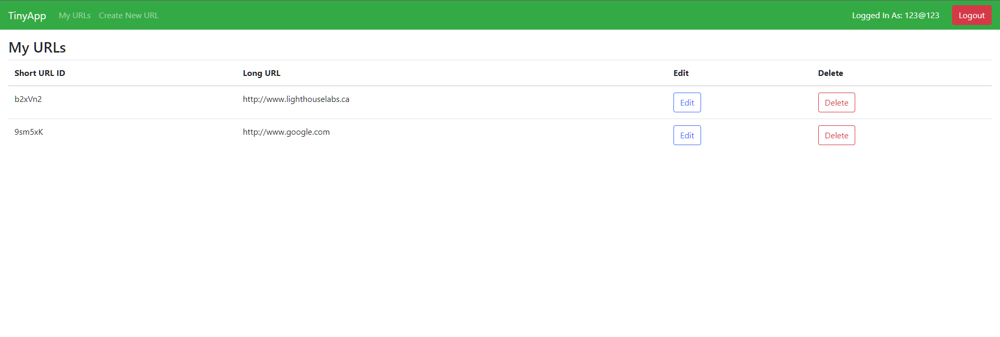
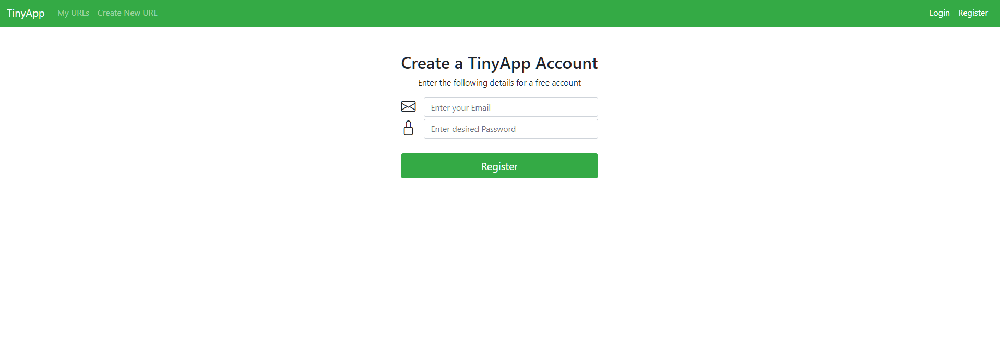
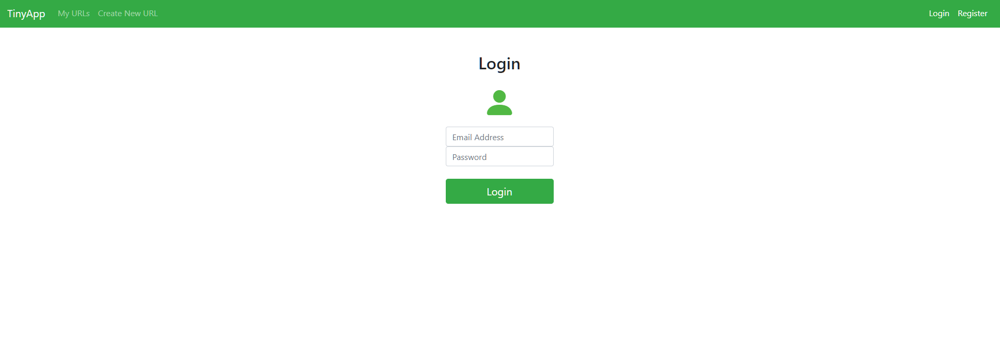
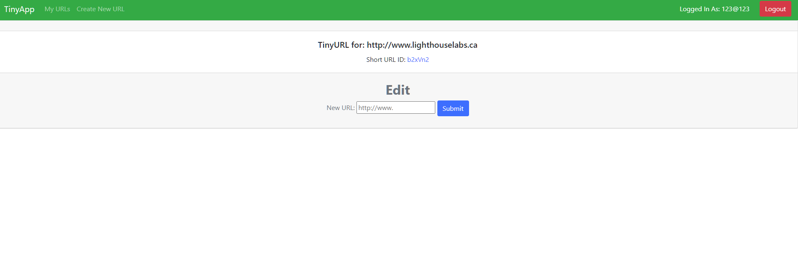

# TinyApp Project

TinyApp is a web application built with Node and Express that allows users to shorten long URLs, which can be created, deleted and edited. 

## Purpose

**_BEWARE:_ This client was published for learning purposes. It is _not_ intended for use in production-grade software.**

This project was created and published by me as part of my learnings at Lighthouse Labs. 

## Product - InProgress
Built With: [Bootstrap](https://getbootstrap.com/)

### Main URL Page

### Registration Page

### Login Page

### Edit Page


## Getting Started

To run tinyApp application, you will need to have NPM installed and its required dependencies, as follows:

- [Node.js](https://docs.npmjs.com/)
- [Express](https://www.npmjs.com/package/express)
- [EJS](https://www.npmjs.com/package/ejs)
- [cookie-parser](https://www.npmjs.com/package/cookie-parser)

### **Installation**

_before the installation make sure you go into the directory where you would like TinyApp to be saved._ 

Clone the repo
> git clone git@github.com:jayrmesa/tinyapp.git
  
Inside the tinyapp directory, install all dependencies
> npm install

Start the development web server
> npm start
 

### Current Configuration

```
- IP address: localhost 
- Port: 8080
- Available registered users: 
  - Email: user@example.com / Password: purple-monkey-dinosaur
  - Email: user2@example.com / Password: dishwasher-funk
```

## Usage

When the server is running, users will be able to login under user@example or register as a new user. The following features are available once you are logged in:
- Create a new shortened link
- View a list of all shortened list.
- Edit url assigned to each generated shortened url
- Delete existing shortened urls

## Documentation
The following files have been developed for the web site:

* `express_server.js`: The back-end database of tinyApp.  The configuration, functions, route handlers and listeners are contained within.

### Views

* `urls_index.ejs`: shows a list of the current short URLs and their associated long URLs, options to edit or delete URL.

* `urls_no-access.ejs`: Front end pane to handle unregister users

* `urls_login.ejs`: Front end pane to show the users to Enter email and password to login.

* `urls_new.ejs`:  Front end pane to allow users to create a new short URL for any long URL.

* `urls_register.ejs`: Front end pane to allow users to create an account.

* `urls_show.ejs`: Front end pane to allow users to edit a long URL

### Views/partials

* `_header.ejs`: Front end pane that contains the navigation links to the site. 